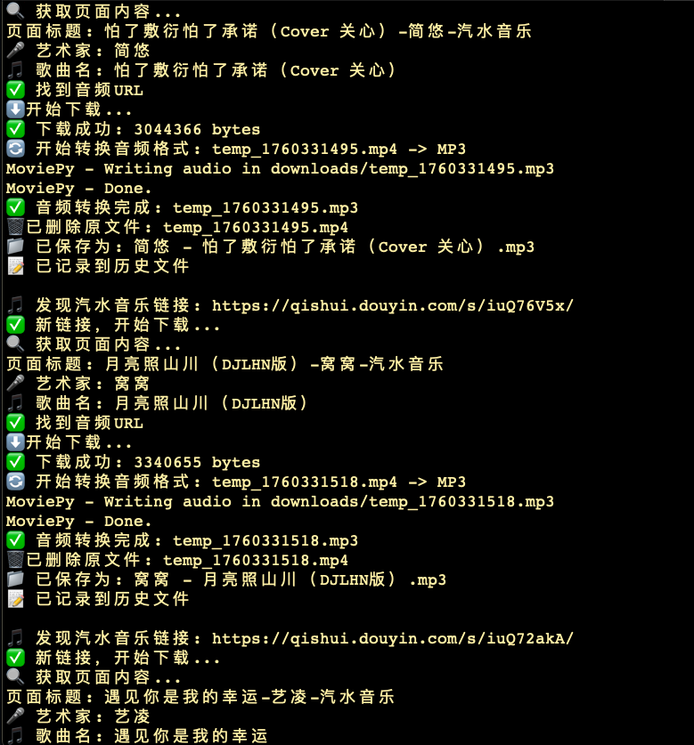

# 🎵 汽水音乐自动下载器

一个基于剪贴板监听的汽水音乐自动下载工具，支持自动提取歌曲信息、去重下载和格式转换,可以下载VIP歌曲。



## ✨ 功能特性

- 🎵 **自动下载**: 监听剪贴板中的汽水音乐分享链接，自动下载音频
- 🎤 **智能命名**: 自动提取艺术家和歌曲名，保存为 `艺术家 - 歌曲名.mp3` 格式
- 🔄 **格式转换**: 自动将MP4转换为MP3格式
- 🚫 **去重功能**: 避免重复下载相同歌曲
- 📝 **历史记录**: 记录已下载的链接，支持历史管理
- 🎯 **精确过滤**: 只处理汽水音乐链接，忽略其他剪贴板内容

## 🖥️ 运行环境

### 系统要求
- **操作系统**: macOS 10.15+ (Catalina或更高版本)
- **Python**: 3.7+
- **浏览器**: Chrome (用于页面解析)

### 依赖工具
- `curl` - 网络请求
- `grep` - 文本处理
- `pbpaste/pbcopy` - 剪贴板操作
- Chrome WebDriver (自动安装)

## 🚀 快速开始

### 1. 克隆项目
```bash
git clone https://github.com/your-username/soda-music-downloader.git
cd soda-music-downloader
```

### 2. 安装依赖
```bash
# 安装Python依赖
pip3 install requests selenium moviepy webdriver-manager

# 或使用虚拟环境
python3 -m venv venv
source venv/bin/activate
pip install requests selenium moviepy webdriver-manager
```

### 3. 运行下载器
```bash
# 进入脚本目录
cd scripts

# 启动自动下载器
./auto_download_final.sh
```

### 4. 使用方法
1. 启动脚本后，它会监听剪贴板
2. 在汽水音乐中找到想要的歌曲
3. 点击 **分享** → **复制链接**
4. 脚本会自动检测并下载音乐

## 📁 项目结构

```
soda-music-downloader/
├── README.md                    # 项目说明
├── LICENSE                      # 开源协议
├── scripts/                     # 脚本文件
│   ├── auto_download_final.sh   # 主下载脚本
│   ├── manage_history.sh        # 历史管理工具
│   └── get_share_link.sh        # 分享链接获取助手
├── docs/                        # 文档和图片
│   ├── demo.png                 # 运行示例图片
│   └── INSTALL.md               # 详细安装说明
└── examples/                    # 示例文件
    └── sample_links.txt         # 示例链接
```

## 🛠️ 脚本说明

### auto_download_final.sh
主要的自动下载脚本，功能包括：
- 监听剪贴板中的汽水音乐链接
- 自动解析歌曲信息
- 下载并转换音频格式
- 去重和历史记录管理

### manage_history.sh
历史记录管理工具：
```bash
# 查看下载历史
./manage_history.sh list

# 查看下载总数
./manage_history.sh count

# 清空历史记录
./manage_history.sh clear
```

### get_share_link.sh
分享链接获取助手，提供交互式指导获取分享链接。

## 📋 使用示例

### 基本使用
```bash
# 启动监听
./auto_download_final.sh

# 在汽水音乐中复制分享链接，脚本会自动处理
```

### 历史管理
```bash
# 查看已下载的歌曲
./manage_history.sh list

# 输出示例：
# 📋 已下载的链接:
#      1  https://qishui.douyin.com/s/iuQsMoP2/
#      2  https://qishui.douyin.com/s/iuQsNeNb/
```

## 🔧 配置说明

### 下载目录
默认下载到 `download_music/` 目录，可以修改脚本中的 `DOWNLOAD_DIR` 变量。

### 历史记录
历史记录保存在 `download_history.txt` 文件中，格式为每行一个链接。

## ⚠️ 注意事项

1. **网络连接**: 需要稳定的网络连接来下载音频文件
2. **存储空间**: 确保有足够的磁盘空间存储音频文件
3. **版权声明**: 下载的音频文件仅供个人学习使用，请遵守相关版权法律
4. **系统权限**: 首次运行可能需要授予终端访问权限

## 🐛 故障排除

### 常见问题

**Q: 脚本无法检测到链接？**
A: 确保复制的是汽水音乐的分享链接，格式应为 `https://qishui.douyin.com/s/xxxxx/`

**Q: 下载失败？**
A: 检查网络连接，确保Chrome浏览器已安装

**Q: 转换失败？**
A: 确保已安装moviepy库：`pip3 install moviepy`

### 调试模式
如需调试，可以在脚本中添加 `set -x` 来查看详细执行过程。

## 🤝 贡献

欢迎提交Issue和Pull Request！

### 开发环境设置
```bash
# 克隆项目
git clone https://github.com/your-username/soda-music-downloader.git

# 创建开发分支
git checkout -b feature/your-feature

# 提交更改
git commit -m "Add your feature"
git push origin feature/your-feature
```

## 📄 开源协议

本项目采用 MIT 协议开源，详见 [LICENSE](LICENSE) 文件。

## 🙏 致谢

- [Selenium](https://selenium-python.readthedocs.io/) - 网页自动化
- [MoviePy](https://zulko.github.io/moviepy/) - 音频处理
- [WebDriver Manager](https://github.com/SergeyPirogov/webdriver_manager) - 浏览器驱动管理

## 📞 联系方式

如有问题或建议，请通过以下方式联系：

- GitHub Issues: [提交问题](https://github.com/your-username/soda-music-downloader/issues)
- Email: your-email@example.com

---

⭐ 如果这个项目对您有帮助，请给个Star支持一下！
